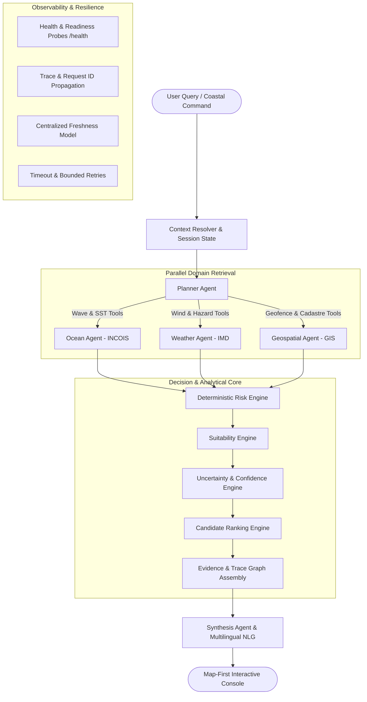

# ORCA System Architecture Specification

**System**: ORCA (Marine EcOsystem Reasoning with Collaborative Agents)  
**Phase**: Phase 6 — Production Hardened Architecture & Observability  
**Revision**: 6.0.0

---

## 1. High-Level Architectural Topology

ORCA operates as a synchronized, decoupled multi-agent intelligence platform composed of a Next.js 14 map-first frontend and a FastAPI backend with 6 specialized agents, 4 authoritative marine data connectors, and a deterministic mathematical risk engine.

---

## 2. Multi-Agent Reasoning Graph

ORCA implements a 6-agent directed graph without arbitrary open-ended loops:

| Agent | Responsibility | Registered Tools | Guardrails & Invariants |
| :--- | :--- | :--- | :--- |
| **Planner Agent** | Natural language intent extraction, spatial bounds normalization, temporal window alignment. | `Query Requirement Schema`, `Temporal Parser` | Max 1 decomposition turn; defaults to operational bounding box. |
| **Ocean Agent** | Interfaces with INCOIS OSF, ERDDAP servers, and ISRO MOSDAC. | `get_wave_forecast`, `get_sst`, `get_pfz_advisories`, `get_chlorophyll_observations` | Bounded retries (2x), cache fallback explicitly labeled `CACHED`. |
| **Weather Agent** | Interfaces with IMD Marine Coastal Division for wind telemetry and squall/cyclone bulletins. | `get_coastal_winds`, `get_marine_warnings` | Failed warning check never defaults to "No Warning". |
| **Geospatial Agent** | Shapely polygon intersection against verified naval and port cadastral buffers. | `check_zone_geofences`, `get_zone_polygons` | Failed geofence check defaults to restricted / unverified. |
| **Risk & Evidence Agent**| Calculates weighted deterministic risk score and compiles auditable evidence graph. | `calculate_zone_risk_scores`, `compile_evidence_graph` | Strict mathematical equations; LLM cannot override scores. |
| **Synthesis Agent** | Natural language executive decisions, trade-offs, advisories, limitations, and multilingual output (English, Hindi, Marathi). | `NLG Decision Composer`, `Multilingual Formatter` | Factual grounding in evidence nodes; disclaimer enforcement. |

---

## 3. Mathematical Foundations & Deterministic Engines

### 3.1 Physical Risk Scoring
$$\text{Risk Score} = w_{\text{wave}} \cdot S_{\text{wave}} + w_{\text{wind}} \cdot S_{\text{wind}} + w_{\text{warning}} \cdot S_{\text{warning}} + w_{\text{current}} \cdot S_{\text{current}}$$
Where weights are strictly calibrated for small-craft coastal navigation:
- $w_{\text{wave}} = 0.45$
- $w_{\text{wind}} = 0.35$
- $w_{\text{warning}} = 0.15$
- $w_{\text{current}} = 0.05$

### 3.2 Candidate Zone Ranking
Zones are ranked into:
1. **Top Candidate**: Highest suitability combined with low operational risk ($\text{Risk} < 35$) and zero restrictions.
2. **Alternative Candidate**: Moderate risk ($\text{Risk} < 65$) suitable under specific operational windows.
3. **Excluded Sectors**: High physical risk ($\text{Risk} \ge 70$), active squall warnings, cadastral restrictions, or `INSUFFICIENT_DATA`.

---

## 4. Cross-Cutting Observability & Hardening

1. **Request Tracing**: Every transaction generates `ORCA-YYYYMMDD-XXXX` propagated across all layers.
2. **Latency Breakdown**: Response payloads provide measured execution timings for Planner, Domain Tools, Risk Engine, and Synthesis.
3. **Data Freshness Contract**: Records strictly distinguish `OBSERVATION`, `FORECAST`, `ADVISORY`, `WARNING`, `STATIC`, `CACHED`, and `UNKNOWN`.
4. **Prompt Injection Defense**: Retrieved marine telemetry is treated strictly as data payloads; planner only executes registered tool schemas.
