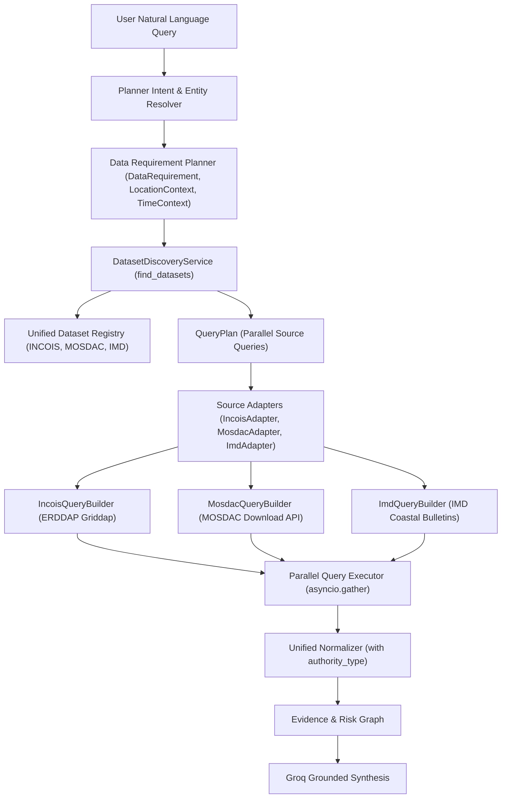

# ORCA — Dataset Discovery & Source-Specific Query Builder Architecture

## 1. Executive Summary & Architecture Philosophy
ORCA employs a deterministic, query-driven retrieval pipeline across India's premier marine and meteorological agencies: **INCOIS**, **ISRO MOSDAC**, and **IMD**.

Natural language questions are never mapped to hard-coded endpoints or fabricated values. The system enforces strict separation of responsibilities:
$$\text{User Query} \longrightarrow \text{Intent \& Entities} \longrightarrow \text{Data Requirements} \longrightarrow \text{Dataset Discovery} \longrightarrow \text{Source-Specific Query Builders} \longrightarrow \text{Parallel Async Retrieval} \longrightarrow \text{Normalization} \longrightarrow \text{Grounded Evidence Graph} \longrightarrow \text{Groq LLM Synthesis}$$



---

## 2. Core Models

### 2.1 DataRequirement Schema
[backend/app/schemas/query_plan.py](file:///c:/Users/Omkar/Desktop/SIH/backend/app/schemas/query_plan.py) defines the structured requirements extracted from user queries:
- `parameter`: `WAVE`, `SST`, `CURRENT`, `CHLOROPHYLL`, `WIND`, `WARNINGS`, `RESTRICTIONS`.
- `source_preference`: e.g. `["MOSDAC", "INCOIS"]` or `["IMD"]`.
- `required`: Boolean flag indicating whether the parameter is mandatory.
- `purpose`: `FISHING_SUITABILITY`, `MARINE_SAFETY`, `SEA_CONDITIONS`.
- `priority`: `CRITICAL`, `HIGH`, `MEDIUM`, `LOW`.

### 2.2 LocationContext & Seaward Bounding Box
- **Dynamic Coastal Registry**: Supports all major Indian coastal ports and shelf zones (Nagapattinam, Mumbai, Goa, Kochi, Chennai, Visakhapatnam, Kanyakumari, Mangalore, Paradip).
- **Seaward Bounding Box Generation**: Seaward-oriented offsets (eastward for Bay of Bengal / Coromandel Coast, westward for Arabian Sea).

### 2.3 TimeContext
- Converts expressions like `"tomorrow morning"` (06:00–12:00 IST), `"tomorrow evening"` (16:00–21:00 IST), `"next 6 hours"` into strict ISO-8601 UTC query bounds.

---

## 3. Verified Multi-Source Dataset Registry

Maintained in [backend/app/services/discovery/registry.py](file:///c:/Users/Omkar/Desktop/SIH/backend/app/services/discovery/registry.py):

| Dataset ID | Source | Parameters | Data Type | Query Interface | Description |
| :--- | :--- | :--- | :--- | :--- | :--- |
| `incois_ww3_regional` | **INCOIS** | `WAVE`, `WAVE_CONDITIONS` | `FORECAST` | `ERDDAP` | Multi-grid WaveWatch-III hydrodynamic wave forecast (0.1° resolution). |
| `incois_roms_hydrodynamics` | **INCOIS** | `CURRENT`, `SEA_CONDITIONS` | `FORECAST` | `ERDDAP` | 3D ROMS ocean circulation forecast for surface & subsurface u/v current vectors. |
| `incois_sst_composite` | **INCOIS** | `SST`, `SST_QUERY` | `ANALYSIS` | `ERDDAP` | High-resolution foundation SST analysis blending INSAT-3DR, AVHRR, MODIS, and Argo. |
| `incois_ocm_chlorophyll` | **INCOIS** | `CHLOROPHYLL` | `OBSERVATION` | `ERDDAP` | Bio-optical chlorophyll-a product derived from Oceansat OCM sensors. |
| `incois_pfz_advisory_table` | **INCOIS** | `PFZ`, `ADVISORY` | `ADVISORY` | `ERDDAP` | Authoritative PFZ advisory sectors integrating thermal fronts and chlorophyll. |
| `O3_OCM_L3_DAILY_CHL` | **MOSDAC** | `CHLOROPHYLL` | `OBSERVATION` | `MOSDAC_DOWNLOAD_API` | ISRO Oceansat-3 Level-3 daily chlorophyll-a swath passes (360m / 1 km resolution). |
| `3R_IMG_L3C_SST_DAILY` | **MOSDAC** | `SST` | `OBSERVATION` | `MOSDAC_DOWNLOAD_API` | ISRO INSAT-3DR geostationary thermal infrared SST retrievals (4 km resolution). |
| `SCAT_L3_WIND_DAILY` | **MOSDAC** | `WIND` | `OBSERVATION` | `MOSDAC_DOWNLOAD_API` | ISRO SCATSAT-1 / Oceansat-3 Scatterometer 10m ocean surface wind vectors. |
| `imd_coastal_marine_bulletin` | **IMD** | `WIND`, `WARNINGS` | `FORECAST` | `IMD_BULLETIN_API` | Official statutory coastal marine warning bulletins for fishermen and port signals. |
| `imd_station_marine_forecast` | **IMD** | `WIND`, `WEATHER` | `FORECAST` | `IMD_BULLETIN_API` | Numerical weather prediction station forecasts for coastal wind, gusts, and sea state. |

---

## 4. Source-Specific Query Builders

### 4.1 INCOIS ERDDAP Query Builder
- **Syntax**: `https://erddap.incois.gov.in/erddap/griddap/<dataset_id>.json?<var>[(<start_time>):stride:(<end_time>)][(<min_lat>):stride:(<max_lat>)][(<min_lon>):stride:(<max_lon>)]`
- **Safety Limits**: Max lat/lon span $\le 5.0^\circ$, max time span $\le 7$ days, max variables per request $\le 8$.

### 4.2 MOSDAC Download API Query Builder
- **Manual**: Refers to [ISRO MOSDAC Download API Manual](https://mosdac.gov.in/downloadapi-manual).
- **Search Payload**:
  ```json
  {
    "datasetId": "O3_OCM_L3_DAILY_CHL",
    "startTime": "2026-09-10",
    "endTime": "2026-09-10",
    "count": 5,
    "boundingBox": "79.8430,10.5170,80.3430,11.0170",
    "gId": ""
  }
  ```
- **Ordering**: Bounding box strictly formatted as `minLon,minLat,maxLon,maxLat`.

### 4.3 IMD Coastal Bulletin Query Builder
- Constructs station-specific and regional coastal queries validating coastal state and marine coordinate boundaries.

---

## 5. Parallel Async Execution Engine
Implemented in [backend/app/services/discovery/executor.py](file:///c:/Users/Omkar/Desktop/SIH/backend/app/services/discovery/executor.py):
- Groups planned query items across sources.
- Invokes independent adapters concurrently via `asyncio.gather(*tasks)`.
- Handles timeouts, retries, circuit breaking, and source-level caching.
- Emits structured telemetry logs with sanitized identifiers (no credentials).

---

## 6. Multi-Turn Conversational Context Reuse
When a user asks follow-up questions:
1. **Inheritance**: Retains `LocationContext` (e.g., Nagapattinam) and `TimeContext` (e.g., Tomorrow Morning).
2. **Delta Retrieval**: Only queries newly requested parameters (e.g., querying MOSDAC for `CHLOROPHYLL` without re-downloading wave forecasts).
3. **Session Reset**: New conversations (`+ NEW CONVERSATION`) completely flush session caches and re-initialize context.
