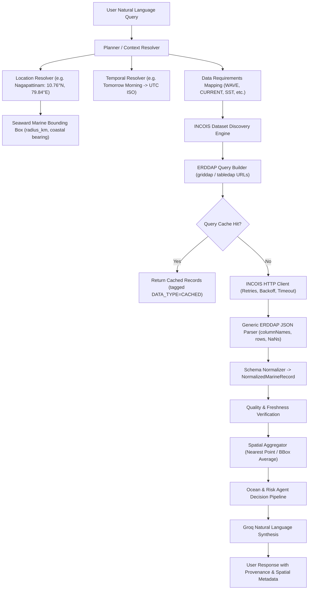

# INCOIS Query-Driven Data Retrieval Architecture

## 1. Executive Summary & Objective

ORCA features a **Query-Driven, Multi-Parameter Spatial-Temporal Data Retrieval Subsystem** that connects conversational user inquiries to the official **INCOIS ERDDAP** oceanographic server.

Instead of hard-coded station grids or static assumptions, the data flow dynamically resolves:
$$\text{User Query} \longrightarrow \text{Intent} \longrightarrow \text{Location} \longrightarrow \text{Time Window} \longrightarrow \text{Data Requirements} \longrightarrow \text{Dataset Discovery} \longrightarrow \text{ERDDAP Subsetting} \longrightarrow \text{Normalization} \longrightarrow \text{Quality Control} \longrightarrow \text{Deterministic Reasoning} \longrightarrow \text{Groq Synthesis}$$

---

## 2. End-to-End Operational Pipeline

---

## 3. Verified INCOIS ERDDAP Dataset Catalogue

All dataset IDs, variables, and dimensions match the official INCOIS ERDDAP metadata catalogue (`https://erddap.incois.gov.in/erddap/`):

| Dataset ID | Parameter Category | Data Semantics | Variables Bundled | Dimensions | Spatial / Temporal Resolution | Official Documentation |
| :--- | :--- | :--- | :--- | :--- | :--- | :--- |
| `incois_ww3_regional` | **WAVE** | `FORECAST` | `swh` (Significant Wave Height), `mwp` (Mean Period), `mwd` (Direction), `swell_height`, `shww` | `[time][latitude][longitude]` | $0.05^\circ$ / 3-hourly | [INCOIS WW3 Griddap](https://erddap.incois.gov.in/erddap/griddap/incois_ww3_regional.html) |
| `incois_roms_hydrodynamics` | **CURRENT** | `FORECAST` | `u` (Eastward velocity), `v` (Northward velocity), `temp` (SST), `salinity` | `[time][latitude][longitude]` | $0.08^\circ$ / 6-hourly | [INCOIS ROMS Griddap](https://erddap.incois.gov.in/erddap/griddap/incois_roms_hydrodynamics.html) |
| `incois_sst_composite` | **SST** | `ANALYSIS` | `sst` (Sea Surface Temp), `sst_anomaly` | `[time][latitude][longitude]` | $0.05^\circ$ / Daily | [INCOIS SST Griddap](https://erddap.incois.gov.in/erddap/griddap/incois_sst_composite.html) |
| `incois_ocm_chlorophyll` | **CHLOROPHYLL** | `OBSERVATION` | `chlorophyll` (Chlorophyll-a concentration), `kd_490` (Turbidity) | `[time][latitude][longitude]` | $0.04^\circ$ / Daily | [INCOIS OCM Griddap](https://erddap.incois.gov.in/erddap/griddap/incois_ocm_chlorophyll.html) |
| `incois_pfz_advisory_table` | **PFZ ADVISORY** | `ADVISORY` | `sector`, `latitude`, `longitude`, `bearing`, `distance_km`, `depth_m`, `valid_date` | Tabular (`time`, `lat`, `lon`) | Daily Advisory Bulletins | [INCOIS PFZ Tabledap](https://erddap.incois.gov.in/erddap/tabledap/incois_pfz_advisory_table.html) |

---

## 4. Intent-to-Data-Requirements Matrix

| User Intent | Required Marine Parameters | Matching INCOIS Datasets |
| :--- | :--- | :--- |
| `SEA_CONDITIONS` | `WAVE`, `CURRENT`, `SST` | `incois_ww3_regional`, `incois_roms_hydrodynamics`, `incois_sst_composite` |
| `WAVE_CONDITIONS` | `SIGNIFICANT_WAVE_HEIGHT`, `SWELL_HEIGHT`, `WAVE_PERIOD`, `WAVE_DIRECTION` | `incois_ww3_regional` |
| `FISHING_SUITABILITY` | `WAVE`, `WIND`, `CURRENT`, `SST`, `CHLOROPHYLL`, `PFZ`, `WARNINGS`, `RESTRICTIONS` | `incois_ww3_regional`, `incois_roms_hydrodynamics`, `incois_sst_composite`, `incois_ocm_chlorophyll`, `incois_pfz_advisory_table`, `IMD_MARINE`, `GIS_CADASTRE` |
| `MARINE_SAFETY` | `WAVE`, `WIND`, `WARNINGS`, `CURRENT`, `RESTRICTIONS` | `incois_ww3_regional`, `IMD_MARINE`, `GIS_CADASTRE`, `incois_roms_hydrodynamics` |
| `SST_QUERY` | `SST` | `incois_sst_composite` |
| `CURRENT_QUERY` | `CURRENT` | `incois_roms_hydrodynamics` |

---

## 5. Location Resolution & Seaward Bounding Box

- **Coverage**: Supports arbitrary coastal sectors, ports, and landing centres across India (e.g. Nagapattinam, Mumbai, Chennai, Kochi, Goa, Visakhapatnam, Kanyakumari, Mangalore, Porbandar, Veraval, Paradip, Puri, Digha, Alibag, Ratnagiri, etc.).
- **Seaward Orientation**: Bounding boxes are computed dynamically using:
  $$\Delta \text{lat} = \frac{\text{radius\_km}}{111.0}, \quad \Delta \text{lon} = \frac{\text{radius\_km}}{111.0 \times \cos(\text{lat})}$$
  - **West Coast (Arabian Sea)**: Extended westward into open waters.
  - **East Coast (Bay of Bengal)**: Extended eastward into open waters.
  - **South Confluence (Kanyakumari)**: Extended southward into the Indian Ocean.

---

## 6. Provenance, Safety Invariants & Fallbacks

1. **Source Provenance Invariant**: Every record stores exact dataset IDs, variables, and ERDDAP request URLs (`source_url`).
2. **Data Semantics Invariant**: `FORECAST`, `OBSERVATION`, `ANALYSIS`, and `ADVISORY` are strictly determined by dataset metadata, never inferred from user phrasing.
3. **Fail-Safe Invariants**:
   - $\text{MISSING DATA} \neq \text{SAFE}$
   - $\text{FAILED WARNING CHECK} \neq \text{NO WARNING}$
   - $\text{FAILED GEOFENCE CHECK} \neq \text{UNRESTRICTED}$
4. **Cache Transparency**: All query cache hits are explicitly labeled with `data_type = "cached"` and original cache timestamps.
